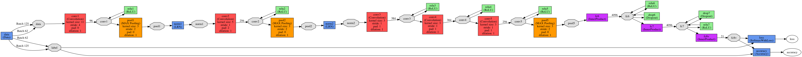

PSU CSE586 Project2 [GroceryCaffeNet] - Jinhang Choi, Jihyun Ryoo
============

This webpage is a report of CSE586 class, second project.

Table of contents :

  * Introduction
  * Background
  * Fine-tuning of CaffeNet
  * Result
  * Summary

Introduction
------------

In this project, we employ [Caffe](http://caffe.berkeleyvision.org/ "Caffe Homepage") [1] as a framework for convolutional neural network.
Also, CaffeNet is used as a CNN model which is a replication of [AlexNet](https://papers.nips.cc/paper/4824-imagenet-classification-with-deep-convolutional-neural-networks "AlexNet") [2] with minor changes. 
CaffeNet model is pre-trained model which experience 310,000 iterations.
Using it as a starting point, we fine-tuned the model with 2014 [ImageNet](http://www.image-net.org/ "ImageNet dataset") dataset.

Background
------------

### Caffe

Caffe is a framework for machine learning which is developed by Berkeley AI Research (BAIR).

It has numerous implementation of general layers used in deep learning; like convolutional layer, normalization layer, pooling layer, relu layer, sigmoid layer, etc.
Also, they provide several neural network models - AlexNet, GoogleNet, CaffeNet, etc. - 

Caffe support CPU and GPU, thus user can choose what they want.  

### AlexNet (CaffeNet)

### ImageNet

Fine-tuning of CaffeNet
------------

|         | apple   | artichoke | bagel   | banana  | bell    | burrito | cucumber  | fig     | guacamole | hamburger | lemon   |
|:-------:|:-------:|:---------:|:-------:|:-------:|:-------:|:-------:|:---------:|:-------:|:---------:|:--------:|:-------:|
| train   | 1081    | 809       | 586     | 733     | 633     | 560     | 492       | 475     | 651       | 555       | 662     |
| val     | 140     | 95        | 87      | 88      | 68      | 84      | 77        | 53      | 90        | 72        | 86      |
| total   | 1221    | 904       | 673     | 821     | 701     | 644     | 569       | 528     | 741       | 627       | 748     |

|         | milk    | mushroom | pineapple | pizza   | pomegranate | popsicle | pretzel | strawberry | water | wine  | summary |
|:-------:|:-------:|:--------:|:---------:|:-------:|:-----------:|:--------:|:-------:|:----------:|:-----:|:-----:|:-------:|
| train   | 501     | 671      | 530       | 730     | 822         | 592      | 571     | 576        | 686   | 733   | 13649   |
| val     | 73      | 75       | 64        | 104     | 79          | 87       | 66      | 83         | 87    | 73    | 1731    |
| total   | 574     | 746      | 594       | 834     | 901         | 679      | 637     | 659        | 773   | 806   | 15380   |

  
  

Result
------------

Summary
------------
[PSU CSE586 Course Project2] Fine-tuning AlexNet from Selected ILSVRC14 Dataset

References
------------
[1] [Yangqing Jia, Evan Shelhamer, Jeff Donahue, Sergey Karayev, Jonathan Long, Ross Girshick, Sergio Guadarrama, Grevor Darrell, "Caffe: Convolutional Architecture for Fast Feature Embedding", arXiv preprint arXiv:1408.5093, 2014.](http://caffe.berkeleyvision.org/ "Caffe Homepage")

[2] [Alex Krizhevsky, Ilya Sutskever, Geoffrey E. Hinton, "ImageNet Classification with Deep Convolutional Neural Networks", NIPS, 2012.](https://papers.nips.cc/paper/4824-imagenet-classification-with-deep-convolutional-neural-networks "AlexNet")

