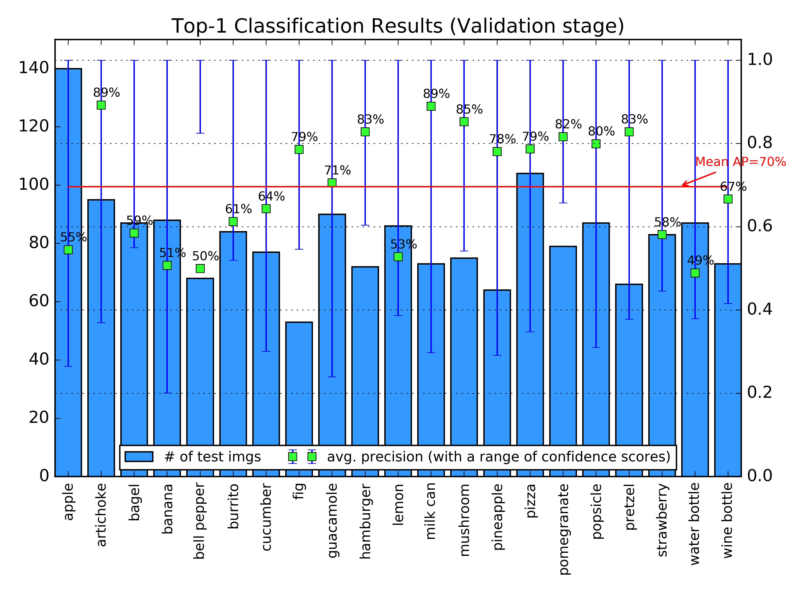

PennState 2017SP CSE586 Project2: Fine-tuning CNN   - Jinhang Choi, Jihyun Ryoo
============

This webpage is a comprehensive report of the second project in CSE586 class.

Table of contents :

  * Introduction
  * Background
  * Fine-tuning CaffeNet
  * Result
  * Summary

Introduction
------------

In this project, we employ Caffe [[1](#Jia14)] as a framework for convolutional neural network (CNN).
Also, as a case study of fine-tuing CNN, we bootstrap CaffeNet [[2](#BAIRCaffeNet)], which is a replication of AlexNet [[3](#Alex12)]. We call the fine-tuned model GroceryCaffeNet because it exploits CaffeNet's capability to identify some grocery items. Training GroceryCaffeNet is based on [ImageNet](http://image-net.org/) Dataset.

Background
------------

### Caffe

Caffe is a framework for machine learning which is developed by Berkeley AI Research (BAIR).

It has numerous implementation of general layers used in CNNs; like convolution, response normalization, maximum/average pooling, rectified linear activation (relu), sigmoid, etc.
Using the layers, user can generate their own model.
Or Caffe provides several CNN references - AlexNet, GoogleNet, CaffeNet, etc. - so user can choose one of them.
In this project, we choosed CaffeNet.

Caffe support CPU (C++) and GPU (CUDA), thus user can choose what they want.

### AlexNet and CaffeNet

Alexnet [[3](#Alex12)] is convolutional neural network which wins the ILSVRC-2012 competition.
The upper figure shows the architecture of CNN.
It consists of five convolutional layers, two local response normalization layers, three max pooling layers and three fully connected layers.

In the paper, alexNet used dataset from ILSVRC-2010, ILSVRC-2012.
They could reduce the top-1 and top-5 error rates substantially compared to sparse coding or SIFT + FVs.

CaffeNet is similar to the AlexNet with some differences.
One is that CaffeNet does not use relighting data-augmentation for training.
The other change is the order of layers.
In AlexNet, the pooling layers come after the normalization layers.
But in CaffeNet, the pooling layers come before the normalization layers.

### ImageNet and ILSVRC

[ImageNet](http://image-net.org/) is  an image dataset that generally used for image training and inference.
It provides more than 15M labeled high resolution images with about 22K categories including different kinds of animals,  vehicels, objects, etc.

ILSVRC (ImageNet Large Scale Visual Recognition Competition) is an annual competition of image classification using ImageNet dataset.
ILSVRC contains 1.2M images in 1K categories.
In this project, we used subset of ILSVRC data.

Fine-tuning CaffeNet
------------
For target data, we decided to use ILSVRC-2014 DET Dataset [[4](#ilsvrc14)] since it does not overlap ILSVRC-2012 Dataset used in CaffeNet. To be specific, we choose 21 of 200 DET classes, which might represent some items in a grocery store. The following table describes a breakdown of image counts in our dataset. Due to annotation issue, all 15,380 images come from DET training dataset, where training/validation dataset are randomly separated in 9:1 manner. For the sake of simplicity, we adapted centered 255x255 downscaling to each image.

|         | apple   | artichoke | bagel   | banana  | bell pepper | burrito | cucumber  | fig     | guacamole |
|:-------:|:-------:|:---------:|:-------:|:-------:|:-----------:|:-------:|:---------:|:-------:|:--------:|
| train   | 1081    | 809       | 586     | 733     | 633         | 560     | 492       | 475     | 651       |
| val     | 140     | 95        | 87      | 88      | 68          | 84      | 77        | 53      | 90        |
| total   | 1221    | 904       | 673     | 821     | 701         | 644     | 569       | 528     | 741       |

|         | hamburger | lemon   | milk can  | mushroom | pineapple | pizza   | pomegranate | popsicle | pretzel |
|:-------:|:---------:|:-------:|:-------:|:--------:|:---------:|:-------:|:-----------:|:--------:|:------:|
| train   | 555       | 662     | 501       | 671      | 530       | 730     | 822         | 592      | 571     |
| val     | 72        | 86      | 73        | 75       | 64        | 104     | 79          | 87       | 66      |
| total   | 627       | 748     | 574       | 746      | 594       | 834     | 901         | 679      | 637     |

|         | strawberry | water bottle | wine bottle | summary |
|:-------:|:----------:|:------------:|:-----------:|:-------:|
| train   | 576        | 686          | 733         | 13649   |
| val     | 83         | 87           | 73          | 1731    |
| total   | 659        | 773          | 806         | 15380   |

As shown in the following CNN scheme, we directly borrowed layers of CaffeNet except softmax, which is composed of 21 classes. Even though reusing weights and biases in CaffeNet, however, we still need to refine the trained parameters for extracting features in some way. As a result, we did not eliminate learning rate of every layers, but fortify training the last fully connected layer [ten times](model/mdl_grocery_caffenet/train_val.prototxt#L364-L371) than other layers. Instead, the initial learning rate decreases to [0.001](model/mdl_grocery_caffenet/solver.prototxt#L4) so that GroceryCaffeNet can rely on the original CaffeNet's parameters. 

Since there are 13,649 images in our training dataset, an epoch is roughly 110 iterations in terms of batch size 125. We repeated testing validation dataset for every 110 iterations to understand a trend of top-1 classification accuracy while training continues. Testing itself takes 28 iterations with batch size 62.

***

  
  
  

    While training Grocery-CaffeNet, we decrease learning rate by one-tenth for every 10K iterations, i.e. rougly 90 GPU epochs. There is no significant difference in both train loss (<b>left</b>) and test accuracy (<b>right</b>) after 30K iterations. Therefore, 30K iterations would be sufficient enough to fine-tune this CNN model.
  
  

***

A trend of classification accuracy in testing validation dataset indicates that GroceryCaffeNet introduces fast convergence even with just an epoch due to derivation of parameters from CaffeNet. In the meantime, we can ensure potential of over-fitting issue by monitoring a trend of trian loss penalty. From our experiments, 45,000 iterations are probed to test the extent of available classification in the current setting. Our model may identify 21 grocery item classes in 76.2% accuracy[1](#fn1).

Result
------------
Let's analyze the top-1 classification accuracy in more detail. To understand what happend to test validation dataset, we deploy GroceryCaffeNet on [classification script](script/classify.py) per image. For your information, please refer to the following [log](result/classification.log).

In deployment, we compare ground truth to the inference result with a highest confidence score so that can figure out which features Grocery-CaffeNet really learns. The only difference in our CNN scheme is data layer to feed an image at a time (batch size 1).

***

  
  

    Since a few of validation images are redundantly tested due to batch size, actual top-1 classification accuracy is slightly lower than the validation trends in training GroceryCaffeNet. Additionally, this test is based on center-cropped 227x227 images. Since ILSVRC-2014 DET dataset does not locate its detection objects at the center of an image, classification accuracy can be deteriorated. For instance, object occlusion in an image keep Grocery-CaffeNet from identifying its class preciesly. Nevertheless, mean average precision is near to 70%.
  

***

Interestingly, Grocery-CaffeNet does not identify some classes which share similar features with other classes such as shape and color[2](#fn2). If we fine-tune more deeper network such as GoogLeNet [[5](#Szeg14)] or ResNet [[6](#Kaiming15)], it would recognize the detailed characteristics with respect to each object class.

Summary
------------
[PSU CSE586 Course Project2] Fine-tuning AlexNet from Selected ILSVRC-2014 Dataset

------------

[1.](#rfn1) The top-1 accuracy of the original CaffeNet is 57.4% against ILSVRC-2012 dataset.

[2.](#rfn2) For instance, red apple versus pomegranate, bagel with vegitable versus hamburger, and water bottle versus wine bottle have visually similar features.

References
------------

[1] [Yangqing Jia, Evan Shelhamer, Jeff Donahue, Sergey Karayev, Jonathan Long, Ross Girshick, Sergio Guadarrama, and Grevor Darrell, "Caffe: Convolutional Architecture for Fast Feature Embedding", arXiv preprint arXiv:1408.5093, 2014.](http://caffe.berkeleyvision.org/ "Caffe Homepage")

[2] [Berkeley AI Research (BAIR) CaffeNet Model](https://github.com/BVLC/caffe/tree/master/models/bvlc_reference_caffenet)

[3] [Alex Krizhevsky, Ilya Sutskever, and Geoffrey E. Hinton, "ImageNet Classification with Deep Convolutional Neural Networks", NIPS, 2012.](https://papers.nips.cc/paper/4824-imagenet-classification-with-deep-convolutional-neural-networks "AlexNet")

[4] [Imagenet Large Scale Visual Recognition Challenge 2014 (ILSVRC-2014) Dataset](http://image-net.org/challenges/LSVRC/2014/index#data)

[5] [Christian Szegedy, Wei Liu, Yangqing Jia, Pierre Sermanet, Scott Reed, Dragomir Anguelov, Dumitru Erhan, Vincent Vanhoucke, and Andrew Rabinovich, "Going Deeper with Convolutions", arXiv preprint arXiv:1409.4842, 2014.](https://github.com/BVLC/caffe/tree/master/models/bvlc_googlenet)

[6] [Kaiming He, Xiangyu Zhang, Shaoqing Ren, and Jian Sun, "Deep Residual Learning for Image Recognition", arXiv preprint arXiv:1512.03385, 2015.](https://github.com/KaimingHe/deep-residual-networks)
